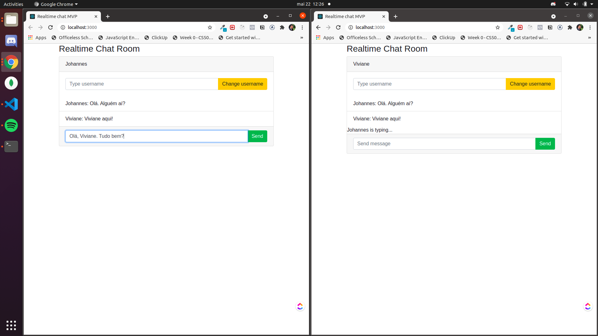

<h1 align="center"> Real time communication with NodeJS </h1>


## Project description
<p align="justify">Build a backend for real time communication between a group of users simultaneouly connected to server using a simple frontend</p>


## Notes about real time communication

Possible applications are:
- Real-time analytics
- Binary streaming
- Instant messaging and chat
- Document collaboration

Building a real-time application is different from building a normal web application. If we try to implement a real-time message app like a normal web application, the client must send a request to the server and, then, receives a response, there are two main options:

1. The user has to refresh the page to check if there are newer messages, which implies in UX problems

2. The client-side should send [AJAX](https://en.wikipedia.org/wiki/Ajax_(programming)) requests to the server in short time intervals to retrieve the newest messages, which implies in waste of computational resources

The solutions demands a change of technology: let's change the communication protocol between client and server and replace HTTP by **WebSocket**.

```
Websockket allows server to send data to client without being properly requested.
```
<image src="https://cdn.merixstudio.com/media/uploads/2020/10/21/real-time-communication.png"/>

## Project main dependencies

- [Socket.io](https://socket.io/): enables real-time, bidirectional and event-based communication. It works on every platform, browser or device, focusing equally on reliability and speed.

- [Express](https://expressjs.com/): web framework for Node.js.

- [nodemon](https://expressjs.com/): a package that restarts the server every time we make a change to the application code. It eliminates the need to manually stop and start the server every time we make a change. Unlike the other packages, we install nodemon as a development dependency since we use it only for development purposes.


## Features
1. Change the username of the user
2. Send messages
3. Show if another user is currently typing a message

## Run application

1. Install dependencies
```
npm install
```

2. run application
```
npm run start
```

A `Server is running on port ${port}` message is expected in terminal console. 3000 is the default port. 

Open two tabs in your browser pointing to [http://localhost:3000](http://localhost:3000) or corresponding port.



## Application structure
```
├── app.js
├── views
├── node_modules
├── package.json
├── public
   ├── css
   ├── js
```
The project structure is very simple:
- `app.js`: file we will use to host our server-side . If the application scale-up and more features are created, each feature can be add to a `services` folder.
- `views`: folder containing the views
- `node_modules`: where we installed our dependencies
- `package.json` npm configuration file
- `public`: directory we will use to store our assets, like css files, javascript files (for the client side), and images.
